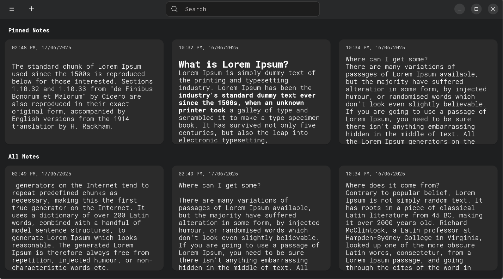
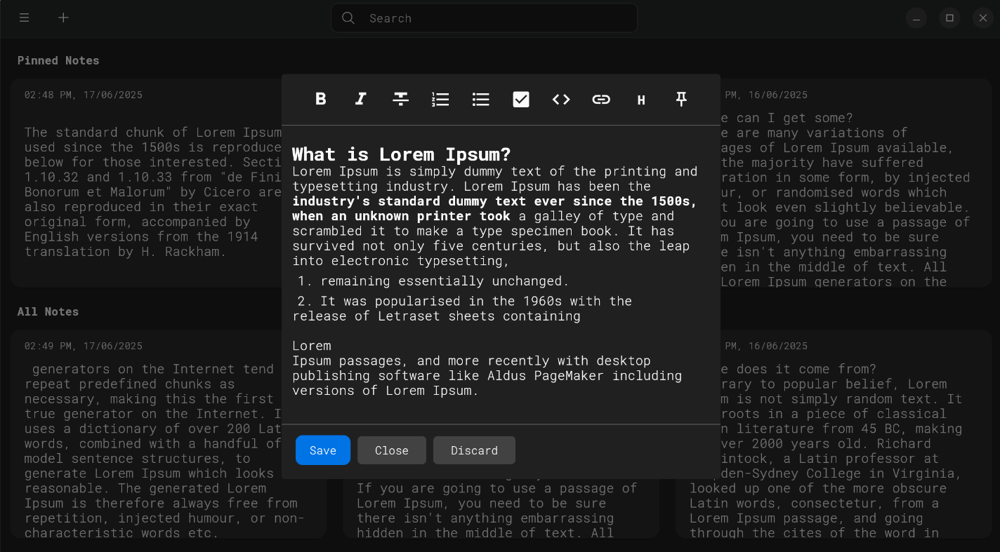

# NoteIt

## Simple note taking app for linux

### Features

* Google keep like grid layout
* Rich text editing
* Pinning notes
* Drag and drop reorder
* Saves all your data to your device
* Import and Export data


### Screenshots
<p float="left">
  
  
</p>

## Installation

### Option 1:  Download the pre-made [binaries](https://github.com/kawsaramin101/noteit/releases/)

### Option 2: Build it yourself


#### Prerequisites

- [Flutter SDK](https://flutter.dev/docs/get-started/install) (latest)
- Dart SDK (bundled with Flutter)
- GTK and related development packages  
  _(required for Flutter Linux desktop support — see [Flutter Linux setup](https://docs.flutter.dev/get-started/install/linux/desktop))_


#### Clone the Repository

```bash
git clone https://github.com/kawsaramin101/noteit.git
cd notes
```
##### Run in debug mode 
```
flutter pub get
flutter run -d linux
```
##### Build in release mode
```
flutter pub get
flutter build linux --release
```
##### Build .deb package (recommended if you want to install)
```
flutter pub get
dart pub global activate flutter_distributor
flutter_distributor release --name=dev --jobs=release-dev-linux-deb
```


## Please create a issue if you found a bug, have suggestion or feature request

## License

This project is licensed under the terms of the [GNU General Public License v3.0](LICENSE.txt).